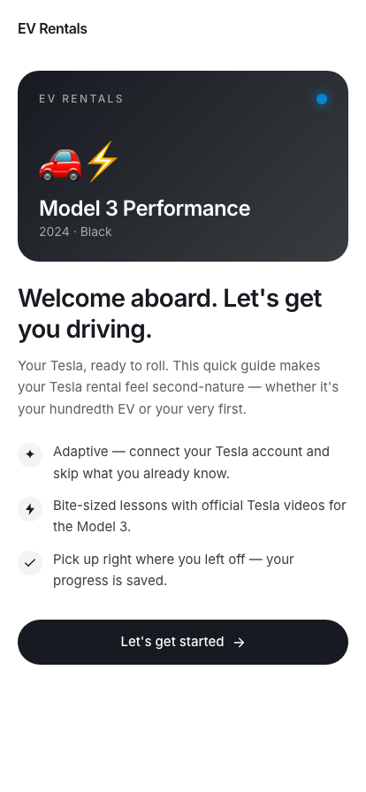
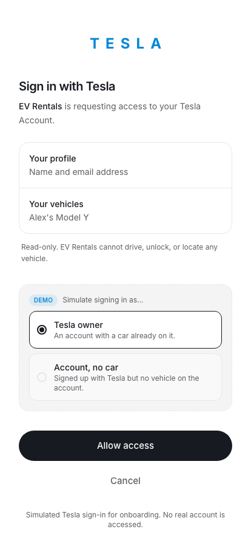
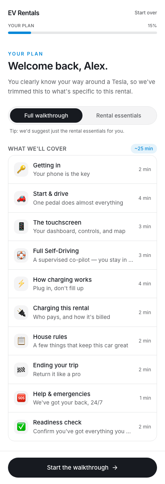
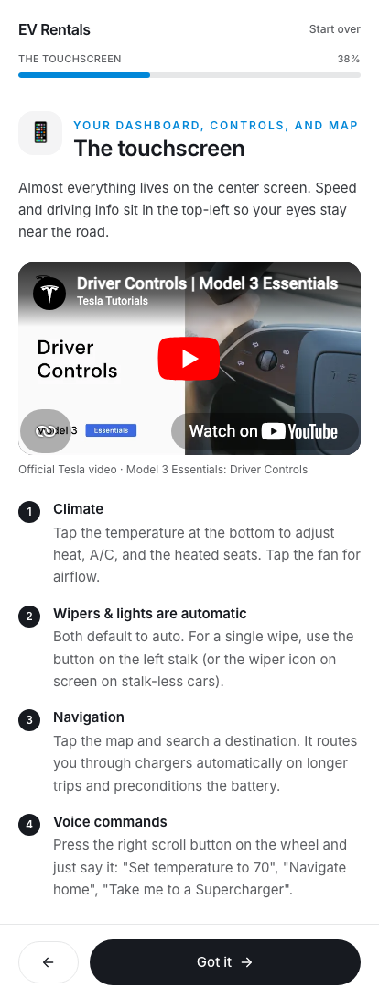
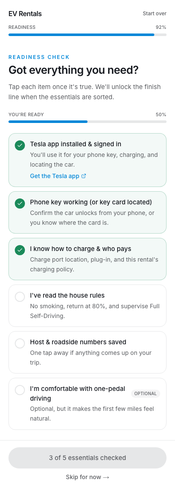
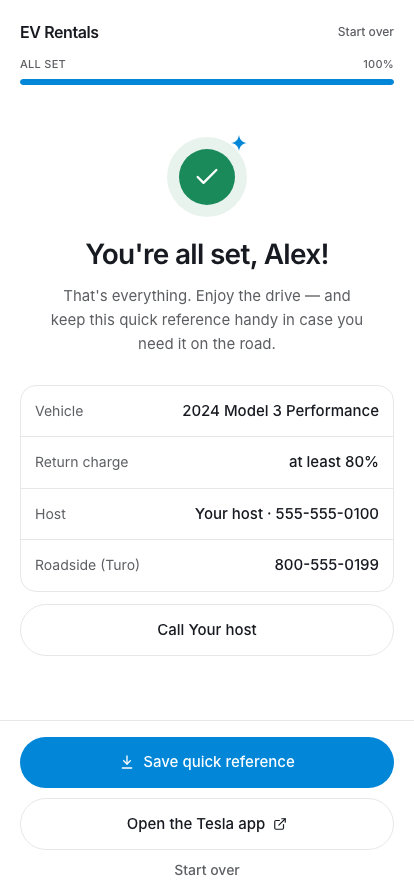

# Onboarding 🚗⚡

An adaptive onboarding web app for **Turo Tesla rental guests**. It gets a guest
from "I've never touched a Tesla" to "keys in hand, confident to drive" in a few
minutes — and gets an experienced owner there in under two.

Built with **Next.js 15 (App Router) + TypeScript + Tailwind v4**.

---

## The idea

Renting a Tesla on Turo is delightful once you know the quirks (no start button,
one-pedal driving, charging, the all-screen UI) — and bewildering before. This app
walks each guest through exactly what *they* need and nothing they don't.

### The smart part: it adapts

Step one is **Connect with Tesla**. The app reads only the guest's name and which
cars are on their account (never any control over a vehicle) to right-size the tour:

| Guest                              | Experience | Default route        |
| ---------------------------------- | ---------- | -------------------- |
| Tesla account **with a car**       | `owner`    | Rental essentials    |
| Tesla account, **no car**          | `account`  | Rental essentials    |
| **New to Tesla** (skips sign-in)   | `new`      | Full walkthrough     |

The guest can always switch between the **full walkthrough** and **rental
essentials** on the plan screen, so the default is helpful, never a trap.

- **Full walkthrough** — getting in, start & one-pedal driving, the touchscreen,
  Full Self-Driving (Supervised), how charging works, plus this rental's specifics.
- **Rental essentials** — only what's specific to *this* car: phone key, charging
  & payment, house rules, return, and help.

### The flow

```
Welcome → Connect with Tesla → Your plan → [tutorial modules] → Readiness check → All set
```

- **Progressive tutorials** with concise host-written steps and a slot for the
  official Tesla Model 3 video on each module.
- **Readiness check** — the "permissions / everything-you-need" sync: an
  interactive checklist (Tesla app installed, phone key working, charging understood,
  house rules read, contacts saved) with a live readiness score. The finish line
  unlocks once the essentials are checked.
- **All set** — a personalized finish with a downloadable quick-reference card,
  one-tap host call, and roadside info.

Progress is saved to `localStorage`, so a guest can close the tab at the
Supercharger and pick up exactly where they left off.

---

## Screenshots

<table>
  <tr>
    <td align="center" width="33%"><br /><sub><b>Welcome</b></sub></td>
    <td align="center" width="33%"><br /><sub><b>Adaptive sign-in</b></sub></td>
    <td align="center" width="33%"><br /><sub><b>Your plan</b></sub></td>
  </tr>
  <tr>
    <td align="center" width="33%"><br /><sub><b>Tutorial + official Tesla video</b></sub></td>
    <td align="center" width="33%"><br /><sub><b>Readiness check</b></sub></td>
    <td align="center" width="33%"><br /><sub><b>All set</b></sub></td>
  </tr>
</table>

> Demo uses placeholder branding and contact details; real values come from `.env.local` (see [Make it yours](#make-it-yours-host-configuration)).

---

## Run it

```bash
pnpm install
pnpm dev          # http://localhost:3000
```

Sign-in runs in **mock mode** by default — no Tesla credentials needed. The
consent screen lets you simulate signing in as an owner or a fresh account so you
can watch the flow adapt.

---

## Make it yours (host configuration)

Everything specific to your car and listing lives in one file:
**[`lib/config.ts`](lib/config.ts)**. Edit the `hostConfig` object — car details,
where the key card is, how charging is paid, house rules, and return instructions —
and the entire experience re-skins itself. No components to touch.

Your **identity and contact details** (company name, host name, phone numbers,
support email) come from `NEXT_PUBLIC_*` environment variables instead of the
source — copy `.env.example` → `.env.local` and fill them in. They're guest-facing,
so they ship to the browser; env just keeps your personal info out of the repo. The
header shows `NEXT_PUBLIC_COMPANY_NAME` as a text wordmark (drop in your own logo in
`components/ui.tsx` if you'd rather).

Tutorial copy and the readiness checklist live in
**[`lib/content.ts`](lib/content.ts)**.

### Official Tesla videos only

Modules embed videos **exclusively from Tesla's own YouTube channels** —
[`@tesla`](https://www.youtube.com/@tesla) and
[`@tesla_tutorials`](https://www.youtube.com/@tesla_tutorials) (Tesla's dedicated
tutorial channel, the same source Tesla embeds on its support pages). Every id was
verified via YouTube's oEmbed endpoint to confirm the uploader is one of those two
channels before being added — no third-party or aggregator videos. A module either
has a verified official video or shows none (there is no link-card fallback, so no
dead links).

Currently embedded:

| Module | Official video | Channel |
| --- | --- | --- |
| Getting in | Access \| Model 3 Essentials | `@tesla_tutorials` |
| Start & drive | Your Tesla can shift directions for you | `@tesla` |
| The touchscreen | Driver Controls \| Model 3 Essentials | `@tesla_tutorials` |
| Full Self-Driving | Full Self-Driving (Supervised) | `@tesla` |
| How charging works / Charging this rental | Supercharging | `@tesla_tutorials` |

To add or change one, verify it's official first, then set `youtubeId`:

```bash
# Confirm author_url is youtube.com/@tesla or @tesla_tutorials before trusting an id:
curl -s "https://www.youtube.com/oembed?format=json&url=https://www.youtube.com/watch?v=<ID>" | jq '.author_name, .author_url'
```
```ts
// lib/content.ts
video: { title: "Model 3 Guide: Driving", youtubeId: "<verified-official-id>" }
```

---

## Going live with real Tesla sign-in

Real **Tesla Fleet API** OAuth (third-party authorization-code flow) is fully wired
up. Flip `NEXT_PUBLIC_TESLA_AUTH_MODE=live`, add credentials, and the same UI runs on
real accounts — the app only ever sees a normalized `TeslaProfile`, so nothing else
changes. The client secret never touches the browser: the token exchange and the
one-time identity + vehicle read happen server-side, then tokens are discarded and
only the profile is sealed into an httpOnly cookie.

**What's implemented**

| Route | Does |
| --- | --- |
| `GET /api/tesla/login` | Mints CSRF `state`, redirects to `auth.tesla.com/oauth2/v3/authorize` |
| `GET /auth/tesla/callback` | Verifies `state`, exchanges code → tokens (server-side), reads identity + vehicles, seals profile cookie |
| `GET /api/tesla/me` | Returns the sealed profile to the client |
| `POST /api/tesla/logout` | Clears the session |
| `/.well-known/.../com.tesla.3p.public-key.pem` | Serves the partner public key (if you register one) |

Token exchange uses `fleet-auth.prd.vn.cloud.tesla.com` (separate host from
authorize, as Tesla requires); region is auto-discovered via `/api/1/users/region`;
identity is read tolerantly from `/api/1/users/me` and the `id_token`; vehicle
`model`/`year` are derived from the VIN (they aren't fields on the vehicle object).

**Setup**

1. Register an application at <https://developer.tesla.com> → get `client_id` +
   `client_secret`. Register your exact redirect URI (`https://<domain>/auth/tesla/callback`)
   and allowed origin.
2. Copy `.env.example` → `.env.local`: set `NEXT_PUBLIC_TESLA_AUTH_MODE=live`,
   `TESLA_CLIENT_ID`, `TESLA_CLIENT_SECRET`, `TESLA_REDIRECT_URI`, and
   `TESLA_SESSION_SECRET` (`openssl rand -hex 32`). Scope defaults to the minimal
   `openid vehicle_device_data`.
3. **Local dev:** Tesla wants HTTPS redirect URIs, so run a tunnel
   (`ngrok http 3000` / `cloudflared`) and register that HTTPS URL. On Vercel the
   deployment URL works directly.
4. **Partner registration (only if Tesla requires it for your app):**
   `node scripts/tesla-setup.mjs genkeys` then `… register` with `TESLA_APP_DOMAIN` set.
   The public key is auto-served at the `.well-known` path.

**Verified, with caveats** — the official docs pages were access-gated during research,
so a few details (the exact `users/me` field names, whether PKCE is supported, and
whether partner registration is mandatory for read-only OAuth) are handled defensively
rather than confirmed. See [`lib/tesla-server.ts`](lib/tesla-server.ts) header comments;
confirm against a live response before launch.

---

## Project layout

```
app/
  layout.tsx              Root layout, Inter font, metadata
  page.tsx                Renders the onboarding app
  globals.css             Design tokens (Tesla palette) + base styles
  auth/tesla/page.tsx     Simulated "Sign in with Tesla" consent screen (mock)
  auth/tesla/callback/    Live OAuth callback (server-side token exchange)
  api/tesla/             login · callback-helpers · me · logout · public-key
lib/
  config.ts               ← Host edits this (car, rules, contacts)
  content.ts              Tutorial modules + readiness checklist
  tesla.ts                Shared account model, personas, mock/live entry
  tesla-server.ts         Server-only: token exchange, identity/vehicle read, cookie seal
  use-tesla-connect.ts    Client hook: launches sign-in, completes the OAuth round-trip
  flow.ts                 Adaptive step machine (which steps, in what order)
  history-nav.ts          Mirrors steps into the browser History API (Back/Forward)
  store.ts                localStorage-backed onboarding state
components/
  OnboardingApp.tsx       Controller: flow + navigation
  ui.tsx                  Button, Card, ProgressBar, Segmented, AppShell…
  VideoEmbed.tsx          Official-Tesla video embed (no link-card fallback)
  icons.tsx               Inline SVG icons (no dependency)
  steps/                  Welcome, Connect, Tesla account, Plan, Module, Checklist, Done
scripts/
  tesla-setup.mjs         genkeys / register / verify for partner registration
```

---

## Notes

- **Privacy posture is real, not decorative.** The integration is read-only and
  scoped to identity + vehicle list. The consent screen says so plainly.
- **Accessible & mobile-first.** Phone-width app shell, large tap targets, visible
  focus rings, keyboard-operable controls — guests will use this on a phone, at the car.
- Official Tesla videos and the Tesla name belong to Tesla; this app links to /
  embeds first-party material rather than rehosting it.
