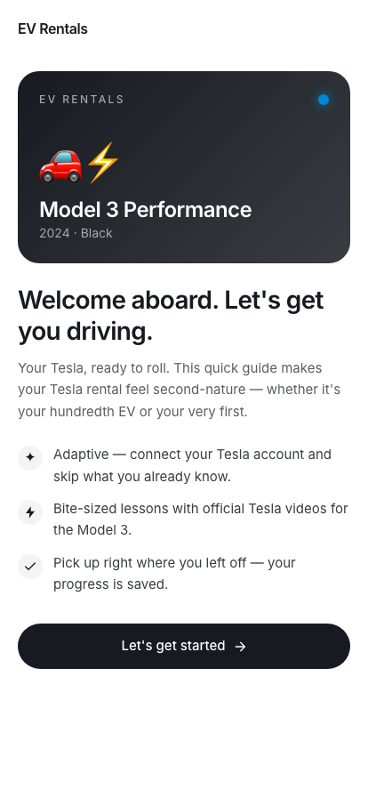
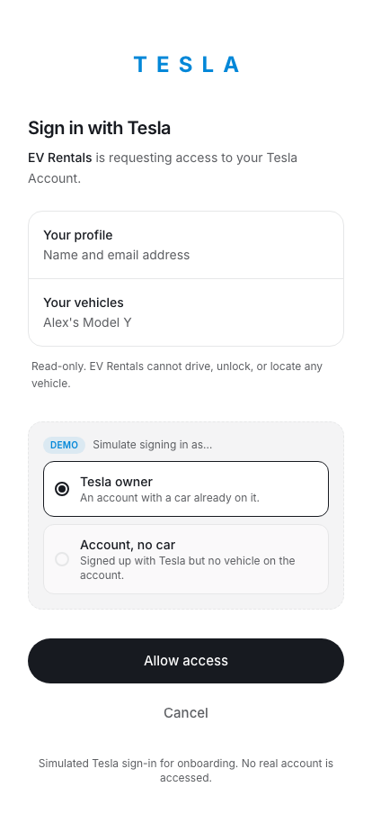
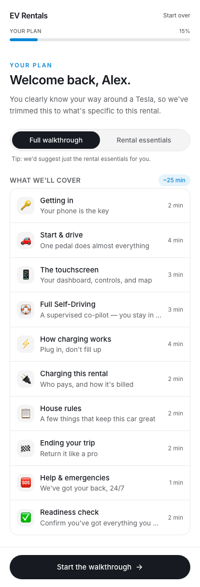
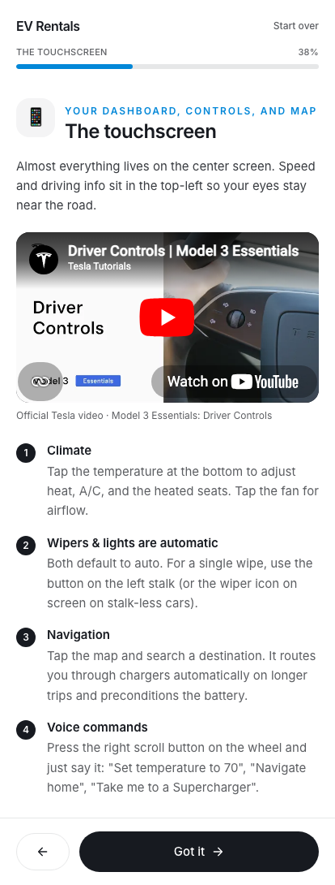
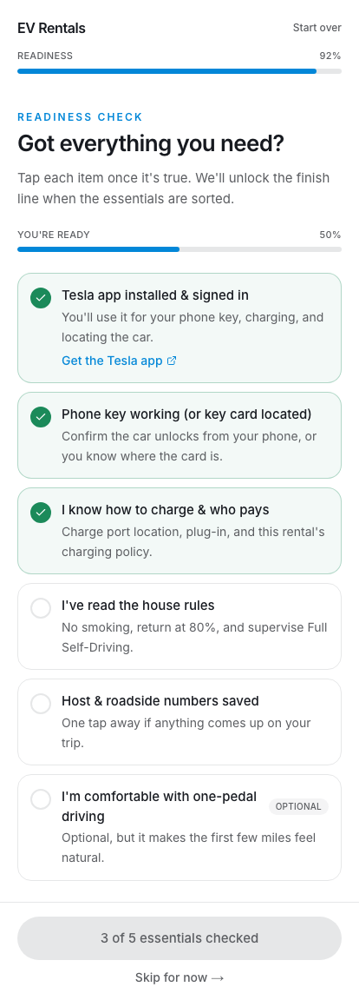
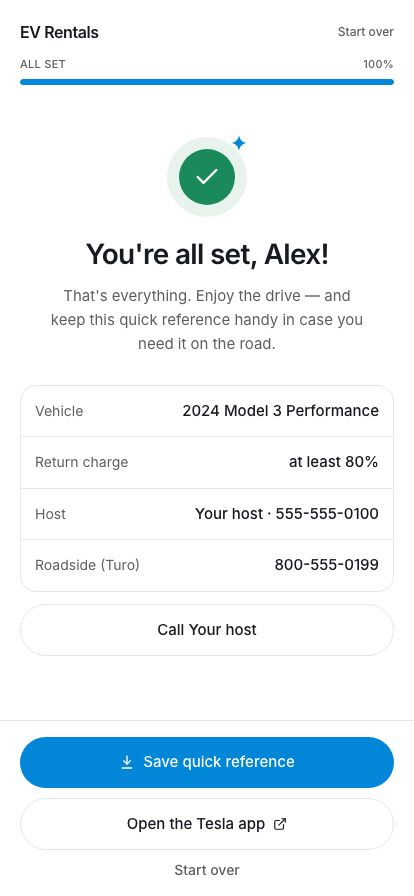

# evhost.app 🚗⚡

An adaptive onboarding web app for **Turo Tesla rental guests**. It gets a guest
from "I've never touched a Tesla" to "keys in hand, confident to drive" in a few
minutes — and gets an experienced owner there in under two.

Built with **Next.js 16 (App Router) + TypeScript + Tailwind v4**.

The tenant-facing product is `evhost.app`. Existing `onlyevs_*` database objects,
storage buckets, and `ONLYEVS_*` environment variables remain stable internal
compatibility identifiers; they are not displayed as the platform brand.

---

## The idea

Renting a Tesla on Turo is delightful once you know the quirks (no start button,
one-pedal driving, charging, the all-screen UI) — and bewildering before. This app
walks each guest through exactly what *they* need and nothing they don't.

### The smart part: it adapts

Step one is **Connect with Tesla**. The app reads only the guest's name and which
cars are on their account (never any control over a vehicle) to right-size the tour:

| Guest                              | Experience | Default route        |
| ---------------------------------- | ---------- | -------------------- |
| Tesla account **with a car**       | `owner`    | Rental essentials    |
| Tesla account, **no car**          | `account`  | Rental essentials    |
| **New to Tesla** (skips sign-in)   | `new`      | Full walkthrough     |

The guest can always switch between the **full walkthrough** and **rental
essentials** on the plan screen, so the default is helpful, never a trap.

- **Full walkthrough** — getting in, start & one-pedal driving, the touchscreen,
  Full Self-Driving (Supervised), how charging works, plus this rental's specifics.
- **Rental essentials** — only what's specific to *this* car: phone key, charging
  & payment, house rules, return, and help.

### The flow

```
Welcome → Connect with Tesla → Your plan → [tutorial modules] → Readiness check → All set
```

- **Progressive tutorials** with concise host-written steps and a slot for the
  official Tesla Model 3 video on each module.
- **Readiness check** — the "permissions / everything-you-need" sync: an
  interactive checklist (Tesla app installed, phone key working, charging understood,
  house rules read, contacts saved) with a live readiness score. The finish line
  unlocks once the essentials are checked.
- **All set** — a personalized finish with a downloadable quick-reference card,
  one-tap host call, and roadside info.

Progress is saved locally so a guest can close the tab at the Supercharger and
pick up exactly where they left off. Guests who enter through an owner-generated
private trip link also publish a bounded progress snapshot to the trip record,
so the owner can follow onboarding from another device. Browser state is scoped
by both workspace and private trip token, so tenants and separate bookings never
reuse one another's walkthrough state.

### Owner dashboard

A host-facing companion at **`/owner`** — deadline-first handoffs, trips,
guests, vehicles, insights, and live readiness in one place, separate from the
guest flow. Desktop uses a persistent light sidebar; mobile keeps five stable
top-level tabs. It shows:

- **Guests & trips** — who's renting, which car, trip dates, and a per-trip
  return checklist (charged to policy, keys returned, cleaned, no damage).
- **New guest onboarding** — a prominent overview action creates a scheduled,
  vehicle-linked trip and returns a one-time private guest URL. The database
  stores only a SHA-256 token hash; regenerating a link invalidates the old one.
- **Live onboarding progress** — after the guest opens the private link, the
  matching trip shows their path, completed modules,
  readiness score, and last update across devices.
- **Charging sessions**, guest history, and alerts, ready for a persistent
  bookings/charging adapter; until one is connected these surfaces render
  explicit empty states rather than sample activity.
- **Vehicle management** — add, edit, remove, and restore cars on the account, with
  a single policy-percentage calculation shared everywhere it's shown. Removed
  vehicles are hidden with a reversible archive, so past trips and guests stay intact.
- **Richer Tesla imports** — the owner connect performs one optional, no-wake
  `vehicle_config` read for each of the first 10 cars to fill trim, exterior
  and interior color, and wheel type.
  Owner and renter cards share first-party Tesla Design Studio renders when
  model generation, trim, paint, wheels, and interior can all be matched.
  Tesla exposes no supported vehicle-image endpoint, so unknown or legacy
  configurations show an explicit official-image-unavailable state instead of
  a generated or representative car.
- **First-run setup wizard** — `/owner/setup` walks a new host through
  connecting their own Tesla account, importing their vehicles (deduped so
  re-running it never creates duplicates), and confirming rental settings.
  It's reached from a dismissible "Set up your fleet" card on the overview
  page, never an automatic redirect, and its own progress is stored
  separately from everything else so starting over never touches your
  vehicle list.
- **Workspace settings** — brand, contact, guest vehicle, rental policy, and
  house rules are editable in setup and at `/owner/settings`. They are saved
  under the active EVhost workspace and update that tenant's guest walkthrough
  without a rebuild or deployment. An imported fleet vehicle can populate the
  guest vehicle in one selection, including trim, exterior, interior, wheels,
  and exact Tesla option codes used by the fail-closed artwork resolver. The
  selected fleet record remains the source, so later owner edits refresh the
  public guest-safe snapshot without publishing VINs, plates, or private notes.
- **Owner identity & workspace branding** — the shell uses a verified sign-in
  provider photo when available, with an owner-managed raster avatar override
  from `/owner/account`. Managers can upload a business logo and browser/PWA
  icon without enabling the background operations control plane, choose an
  accent color, and request a custom guest hostname. Personal avatars are
  user-folder scoped; brand media paths are workspace/shop scoped. Arbitrary
  remote URLs and SVG/HTML uploads are rejected. A scoped worker attaches and
  verifies domains with the deploy provider, and the dedicated EVhost Supabase auth flow
  always completes on the canonical evhost.app broker before returning the guest
  to the same tenant. Platform OAuth, DNS-provider, and encryption credentials
  remain server-managed rather than tenant-editable.
- **Calendar, Tesla access, and fleet stats** — when the background control plane is enabled, an owner can connect Google
  Calendar to populate a review queue that refreshes every 15 minutes,
  explicitly confirm an event into a trip, and schedule time-bounded Tesla driver access after the guest opens the
  private trip link, connects Tesla, and consents. The background control plane
  stores encrypted refresh tokens, reconciles non-idempotent invitation calls,
  consumes Fleet Telemetry for last-known battery/range/odometer/lock state,
  and requests Location only during the exact consented trip window.
  Later provider schedule changes or cancellations are surfaced for review and
  never silently create a duplicate trip, cancel a confirmed booking, or extend
  an issued access window.

It ships without sample owner records. A fresh owner account starts with no
drivers, trips, charging sessions, or vehicles; real or manually entered
vehicles appear after Tesla import or manual add. The temporary data-source
seam in `lib/owner/data-source.ts` returns empty collections until a persistent
bookings/charging backend replaces it.

The browser-local bridge remains as a demo/fallback path, but durable workspaces
use the owner-created private trip capability and server progress RPC without a
guest account or booking-email validation.
Neither path invents a booking or fixture trip. See
[`lib/progress-bridge.ts`](lib/progress-bridge.ts) for that boundary.

### Owner login (Supabase Auth)

`/owner` is **open by default** (demo mode) — nothing to configure. Setting
the Supabase project variables turns on a real sign-in gate in front of it:

```bash
NEXT_PUBLIC_SUPABASE_URL=
NEXT_PUBLIC_SUPABASE_PUBLISHABLE_KEY=
NEXT_PUBLIC_GOOGLE_AUTH_CLIENT_ID=
```

Leave both unset and `/owner` behaves exactly as it does today. Set
`NEXT_PUBLIC_SUPABASE_URL` and `NEXT_PUBLIC_SUPABASE_PUBLISHABLE_KEY` and the
gate is live. Tenant access comes from EVhost-owned `workspace_users`
memberships and row-level-security policies; there is no deployment-wide
email allowlist.

**One-time Supabase dashboard steps:** on the dedicated EVhost project:

1. Under **Authentication → URL Configuration**, set the Site URL to
   `https://evhost.app` and allow `https://evhost.app/auth/callback` (plus
   `http://localhost:3000/auth/callback` for local development).
2. Install the branded, scanner-safe email bodies tracked under
   [`supabase/templates`](supabase/templates). Their links land on
   `https://evhost.app/auth/confirm`; a same-origin POST consumes the one-time
   token only after the owner presses the confirmation button.
3. For Google, register `https://evhost.app` as the JavaScript origin, enable
   the provider in Supabase, and set the public web client ID as
   `NEXT_PUBLIC_GOOGLE_AUTH_CLIENT_ID`. EVhost uses Google Identity Services on
   its own origin and exchanges the resulting nonce-bound ID token with
   Supabase, so Google presents EVhost rather than the Supabase project host.
   Keep `https://<project-ref>.supabase.co/auth/v1/callback` registered as the
   provider callback for operational compatibility.
4. For Apple, create a dedicated Services ID and signing key, register the
   same Supabase callback as the return URL, and enable the provider in
   Supabase. Apple client secrets expire and must be rotated at least every
   six months.

`/auth/callback` accepts PKCE codes and legacy token-hash callbacks, while
the hosted templates use `/auth/confirm` so mailbox scanners cannot consume a
sign-in or recovery token before the owner opens the message.

**First account:** use `/register`, an enabled Google/Apple provider, or enter
the owner email on the magic-link tab. A verified first-time identity creates
an EVhost auth account. The first owner request atomically claims a staged
migrated workspace by email hash or creates a new workspace; no service-role
key participates in identity or workspace claims. `/forgot-password` sends the dedicated recovery
template and `/reset-password` updates the password inside the verified
recovery session.

Signing out from `/owner` is **this-device-only** (`scope: 'local'`) — it
revokes only the current EVhost session.

Sign-in remains password-first for returning accounts, with magic link and
enabled social providers as alternatives. The dashboard redirect-URL and
provider steps above are required for those callbacks to work.

**Build-time requirement:** `NEXT_PUBLIC_SUPABASE_URL`,
`NEXT_PUBLIC_SUPABASE_PUBLISHABLE_KEY`, and the optional Google web client ID
must be present at **build time**, not just at runtime. Next.js inlines
`NEXT_PUBLIC_*` vars into the client bundle during `pnpm build`; setting the
Supabase pair only in the runtime environment (e.g. after a build already ran
without them) leaves the app permanently in demo mode with `/owner` open,
since the browser bundle never saw the vars. Rebuild after adding or changing
any public auth variable.

Password sign-in, registration, magic-link, and password-recovery requests are
lightly throttled app-side to protect the EVhost project's auth rate limits.

---

## Screenshots

<table>
  <tr>
    <td align="center" width="33%"><br /><sub><b>Welcome</b></sub></td>
    <td align="center" width="33%"><br /><sub><b>Adaptive sign-in</b></sub></td>
    <td align="center" width="33%"><br /><sub><b>Your plan</b></sub></td>
  </tr>
  <tr>
    <td align="center" width="33%"><br /><sub><b>Tutorial + official Tesla video</b></sub></td>
    <td align="center" width="33%"><br /><sub><b>Readiness check</b></sub></td>
    <td align="center" width="33%"><br /><sub><b>All set</b></sub></td>
  </tr>
</table>

> Fresh workspaces are empty and guest onboarding remains closed until an owner links an active vehicle, completes the rental settings, and explicitly publishes setup.

---

## Run it

```bash
pnpm install
pnpm dev          # http://localhost:3000
pnpm test         # deterministic unit/contract tests
pnpm build        # strict TypeScript + production build
```

Sign-in runs in **mock mode during local development** by default — no Tesla credentials needed. The
consent screen lets you simulate signing in as an owner or a fresh account so you
can watch the flow adapt. Production builds fail safe to live OAuth if the
build-time auth-mode setting is missing; the simulated consent screen is disabled.

---

## Make it yours (workspace configuration)

Owners configure everything specific to a rental company in `/owner/setup` or
`/owner/settings`: company and host identity, contact details, the guest vehicle,
business logo, app icon, accent color, key and charging instructions, return
policy, and house rules. The settings are
stored as an unpublished draft in `workspace_branding.features.onlyevs` for the
active EVhost workspace. The final fleet-setup action publishes only after
verifying an active linked vehicle and a complete guest configuration. Bare,
unknown, reset, incomplete, and unpublished tenant links show a setup-required
screen instead of seeded content.
The guest vehicle can be linked to an active fleet record so Tesla trim, paint,
interior, and wheel option codes remain attached to the published configuration.
Only guest-safe presentation fields are materialized in workspace branding; VIN,
plate, notes, and operational data stay in the private owner store. When that
linked record changes, an owner session refreshes the public snapshot. Removing
or manually unlinking that record unpublishes guest onboarding rather
than silently allowing drift.
Guest links carry an unambiguous `?tenant=<workspace-id>~<shop-slug>` reference
so the public walkthrough resolves the correct branded shop at runtime—even
when one workspace owns several shops. Legacy shop-slug-only links remain
readable. Verified custom domains resolve the same tenant reference from the
serving Host and therefore require no source edit or app redeploy. Domain
ownership, DNS, and provider attachment must all pass before a hostname
becomes active; Vercel manages certificate issuance and TLS for attached domains.

Confirmed bookings also receive a 256-bit private trip capability at
`/trip/<token>`. That link opens a no-store guest portal with Home, Guide,
Vehicle, and Help surfaces; it expires 24 hours after trip end and does not
create a guest account. Only the token hash is usable from public tables. A
server-only AES-256-GCM envelope is retained in `private` storage so an owner
can resend the current link without rotating it, and is destroyed after expiry.
Reminder delivery is separately gated by `EVHOST_REMINDERS_ENABLED` and uses
SendGrid with database-enforced cooldown and daily attempt limits. Do not enable
it until the configured sender and delivered CTA have passed a controlled
mailbox canary.

The reminder route also requires `SUPABASE_SERVICE_ROLE_KEY`. It is used only
after the cookie-scoped owner RPC has authorized a manager and reserved a
rate-limited attempt; a service-role-only RPC then returns the unmasked
recipient and encrypted link material to server code. Authenticated browser
clients cannot execute that material RPC.

Deployment environment variables remain only for **platform infrastructure**:
Supabase connectivity, Tesla OAuth credentials and registered callbacks, and
the Tesla session-encryption secret. Those values are intentionally not editable
in a browser and must never be stored in public workspace branding JSON.

The additive background control plane is fail-closed behind
`NEXT_PUBLIC_ONLYEVS_OPERATIONS_ENABLED`. Leave it `false` until the lifecycle
migration, scoped worker, command proxy, Kafka/telemetry receiver, provider
credentials, and live revocation/privacy canaries in `deploy/onlyevs/README.md`
are all complete. The Integrations connection center remains available with the
flag off: read-only Tesla fleet import continues to work, and Google Calendar
may run an initial review-queue import when its OAuth credentials are configured.
Live Tesla stats, commands, driver access, and automatic calendar refresh remain
off until the background service passes its gates.

Tutorial copy and the readiness checklist live in
**[`lib/content.ts`](lib/content.ts)**.

### Official Tesla videos only

Modules embed videos **exclusively from Tesla's own YouTube channel**,
[`@tesla`](https://www.youtube.com/@tesla). Every id was verified via YouTube's
oEmbed endpoint to confirm `author_name == "Tesla"` before being added — no
third-party or aggregator videos. (`@tesla_tutorials` / "Tesla Tutorials" is a
third-party fan channel despite the name and does not qualify.) A module either
has a verified official video or shows none (there is no link-card fallback, so no
dead links).

Currently embedded:

| Module | Official video | Channel |
| --- | --- | --- |
| Start & drive | Your Tesla can shift directions for you | `@tesla` |
| Full Self-Driving | Full Self-Driving (Supervised) | `@tesla` |

To add or change one, verify it's official first, then set `youtubeId`:

```bash
# Confirm author_name is "Tesla" before trusting an id:
curl -s "https://www.youtube.com/oembed?format=json&url=https://www.youtube.com/watch?v=<ID>" | jq '.author_name, .author_url'
```
```ts
// lib/content.ts
video: { title: "Model 3 Guide: Driving", youtubeId: "<verified-official-id>" }
```

---

## Going live with real Tesla sign-in

Real **Tesla Fleet API** OAuth (third-party authorization-code flow) is wired for
two deliberately separate actors. Guest OAuth performs a one-time identity and
vehicle-list read, discards tokens, and seals only a normalized profile in an
httpOnly cookie. Owner OAuth uses the same read-only import scope while the
background control plane is disabled. Once that reviewed capability is enabled,
it requests the persistent scopes needed for trip-bound driver invitations and
Fleet Telemetry; its refresh token is envelope-encrypted in the private
integration store and is never returned to a browser. Both flows keep the client
secret server-side.

**What's implemented**

| Route | Does |
| --- | --- |
| `GET /api/tesla/login` | Mints CSRF `state`, redirects to `auth.tesla.com/oauth2/v3/authorize` |
| `GET /auth/tesla/callback` | Verifies `state`, exchanges code → tokens (server-side), reads identity + vehicles, seals profile cookie |
| `GET /api/tesla/me` | Returns the sealed profile to the client |
| `POST /api/tesla/logout` | Clears the session |
| `/.well-known/.../com.tesla.3p.public-key.pem` | Serves the partner public key (if you register one) |

Token exchange uses `fleet-auth.prd.vn.cloud.tesla.com` (separate host from
authorize, as Tesla requires); region is auto-discovered via `/api/1/users/region`;
identity is read tolerantly from `/api/1/users/me` and the `id_token`; vehicle
`model`/`year` are derived from the VIN. The owner callback additionally makes
one best-effort, no-wake `vehicle_data?endpoints=vehicle_config` read for each
of the first 10 cars to import trim, exterior/interior color, and wheels. The
guest sign-in remains list-only.

**Setup**

1. Register an application at <https://developer.tesla.com> → get `client_id` +
   `client_secret`. Register your exact redirect URI (`https://<domain>/auth/tesla/callback`)
   and allowed origin.
2. Copy `.env.example` → `.env.local`: set `NEXT_PUBLIC_TESLA_AUTH_MODE=live`,
   `TESLA_CLIENT_ID`, `TESLA_CLIENT_SECRET`, `TESLA_REDIRECT_URI`, and
   `TESLA_SESSION_SECRET` (`openssl rand -hex 32`). `TESLA_SCOPES` controls the
   guest's minimal `openid vehicle_device_data` flow; the owner route uses its
   fixed reviewed scope set (`openid offline_access vehicle_device_data
   vehicle_cmds vehicle_location`).
3. **Local dev:** Tesla wants HTTPS redirect URIs, so run a tunnel
   (`ngrok http 3000` / `cloudflared`) and register that HTTPS URL. On Vercel the
   deployment URL works directly.
4. **Partner registration (only if Tesla requires it for your app):**
   `node scripts/tesla-setup.mjs genkeys` then `… register` with `TESLA_APP_DOMAIN` set.
   The public key is auto-served at the `.well-known` path.

**Provider boundary:** invitation creation has no provider idempotency key, so the
worker records the invitation set before POST and reconciles exactly one new id
afterward. It never retries an ambiguous create. After redemption, the worker
lists the owner-visible Tesla drivers and HMAC-matches the bound guest's verified
Tesla subject. It calls the driver-removal endpoint only when exactly one
`share_user_id` matches; zero or multiple matches fail closed to `manual_review`.
The raw Tesla subject is never persisted.

### Owner Tesla connect (live)

The owner-side fleet setup wizard (`/owner/setup`) connects to Tesla
independently from the guest flow, with separate OAuth state and its own
redirect URI. With the operations control plane enabled, a fixed-size opaque
import handle resolves a private 15-minute server session and the rotating
refresh credential is encrypted for the worker. While that control plane is
disabled, the callback instead seals a short-lived access credential in an
httpOnly cookie; `/api/owner/tesla/me` consumes it once, fetches the complete
fleet, and deletes it. Neither path places VIN/fleet JSON in a cookie, so large
fleets do not overflow per-cookie limits. Register
`https://<domain>/auth/owner/tesla/callback` as a **second** redirect URI in the
Tesla developer dashboard and set it as `TESLA_OWNER_REDIRECT_URI`, distinct
from the guest's `TESLA_REDIRECT_URI`. The owner must also pair the application's
virtual key with each supported vehicle before command-proxy-backed Fleet
Telemetry configuration can sync. In mock mode no durable provider integration
is created.

The complete background-service contract, scoped database role, official Tesla
command-proxy template, telemetry collector configuration, and production gates
are documented in [`deploy/onlyevs/README.md`](deploy/onlyevs/README.md).

---

## Project layout

```
app/
  layout.tsx              Root layout, Inter font, metadata
  page.tsx                Renders the onboarding app
  globals.css             Design tokens (Tesla palette) + base styles
  auth/tesla/page.tsx     Simulated "Sign in with Tesla" consent screen (mock)
  auth/tesla/callback/    Live OAuth callback (server-side token exchange)
  api/tesla/             login · callback-helpers · me · logout · public-key
  owner/                  Host dashboard: page, drivers/, trips/, vehicles/, setup/, settings/
lib/
  tenant-config.ts        Runtime-validated per-workspace public configuration
  tenant-flow.ts          Applies tenant configuration to guest modules/checklist
  tenant-storage.ts       Tenant-scoped browser-storage keys + legacy migration
  config.ts               Legacy default shape; no longer a host editing surface
  content.ts              Tutorial modules + readiness checklist
  tesla.ts                Shared account model, personas, mock/live entry
  tesla-server.ts         Server-only: token exchange, identity/vehicle read, cookie seal
  use-tesla-connect.ts    Client hook: launches sign-in, completes the OAuth round-trip
  flow.ts                 Adaptive step machine (which steps, in what order)
  history-nav.ts          Mirrors steps into the browser History API (Back/Forward)
  store.ts                localStorage-backed onboarding state
  owner/                  Owner-side data: types, empty data-source seam, derive, alerts,
                           owner-state.ts (rtr:owner:v1), vehicle-state.ts (rtr:vehicles:v1)
components/
  OnboardingApp.tsx       Controller: flow + navigation
  ui.tsx                  Button, Card, ProgressBar, Segmented, AppShell…
  VideoEmbed.tsx          Official-Tesla video embed (no link-card fallback)
  icons.tsx               Inline SVG icons (no dependency)
  steps/                  Welcome, Connect, Tesla account, Plan, Module, Checklist, Done
  owner/                  OwnerShell, vehicle-form.tsx, owner-ui.tsx (VehicleChip, TripTable…)
scripts/
  tesla-setup.mjs         genkeys / register / verify for partner registration
```

---

## Notes

- **Privacy posture is real, not decorative.** Guest OAuth remains read-only.
  The separately consented owner integration can create/revoke driver invitations
  and configure Fleet Telemetry, but the app exposes no general vehicle-control
  UI. Location is excluded from baseline stats and dynamically enabled only for
  a bound, consented trip window.
- **Accessible & mobile-first.** Phone-width app shell, large tap targets, visible
  focus rings, keyboard-operable controls — guests will use this on a phone, at the car.
- Official Tesla videos, vehicle artwork, and the Tesla name belong to Tesla;
  this app links to / embeds first-party material rather than rehosting it.

---

## License

[MIT](LICENSE). Tesla, Model 3, Supercharger, and related marks are trademarks of
Tesla, Inc. and are used here only to describe the vehicle; this project is not
affiliated with or endorsed by Tesla.
